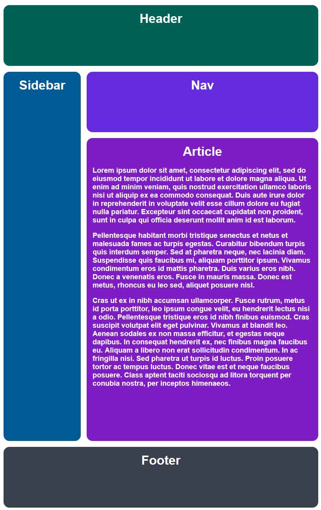
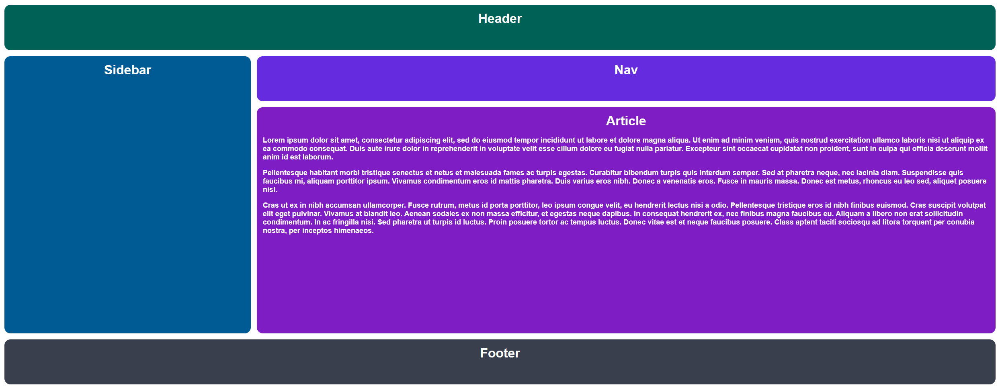

# Адаптивный макет "Святого Грааля" с использованием сетки

Для этого упражнения мы возьмем наш макет "Святого Грааля" из первого упражнения и сделаем его адаптивным. Для этого мы просто изменим наши фиксированные размеры треков на динамические. Рассматривайте это как разминку перед следующим упражнением, и убедитесь, что ваш макет правильно реагирует на изменение размера окна браузера.

### Подсказки

- Вам нужно добавить только селекторы в CSS.
- Используйте динамические размеры треков для ваших столбцов и строк.

## Желаемый результат

При узком окне браузера:

При растянутом окне браузера:

### Проверка
- Расстояние между элементами - 15px.
- Сетка имеет два столбца.
- Сетка имеет четыре строки.
- Треки сетки не используют статические размеры (нет пикселей!).
- Второй столбец в три раза больше другого.
- Третья строка в пять раз больше остальных.
- Строки и столбцы растягиваются в ширину при увеличении размера окна браузера.
- Строки и столбцы растягиваются в высоту при уменьшении размера окна браузера.
